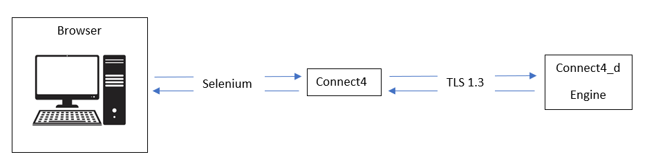

Connect4
==========
Project is based on two parts. connect4(client) and connect4_d(server). Connect4 establish the link between the browser and the connect4_d. Connect4_d is a server where the engine (AI) is. Connect4 scrap end send the current grid to connect4_d, connect4_d return the best position where play to the client who place the coin.

Details:
----------
Client(PHP 7.4 Symfony5.2) and server(Language C) exchanges are done in TCP. The server is accessible only from the localhost and can have only one connection in parallel. Exchanges are encrypted with [TLS1.3](https://en.wikipedia.org/wiki/Transport_Layer_Security).

Commandes
----------
make run_server : to start the server
make run_client : to start the client
